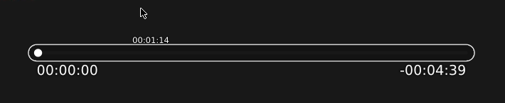

## About

This place contains my customizations to Celluloid's appearance.

This `osc.lua` file was copied from [here](https://raw.githubusercontent.com/mpv-player/mpv/448fe0226b469df9f8a109a9840afa00bc59b48c/player/lua/osc.lua) and patched to include `do return "" end` after 2083 line. The purpose was to get a clean "progress bar", without any cache info:

Note that (maybe a bug, but) in order to use the mouse, that option gets available if you put the cursor somewhere above the bar.

 

### Usage

To have this result, here are the steps to do in _Preferences_:

1. In _Interface_ tab, unckeck _Use floating controls in windowed mode_.
2. In _Miscellaneous_ tab, set the followings in _Extra mpv options_:
   `--script-opts=osc-layout=slimbox,osc-seekbarstyle=knob,osc-seekrangestyle=line,osc-seekrangealpha=250,osc-boxalpha=200 --sub-font-size=28 --sub-font="Fira Sans"`
3. In _Plugins_ tab, click `+` button and add the `osc.lua` file to it.

