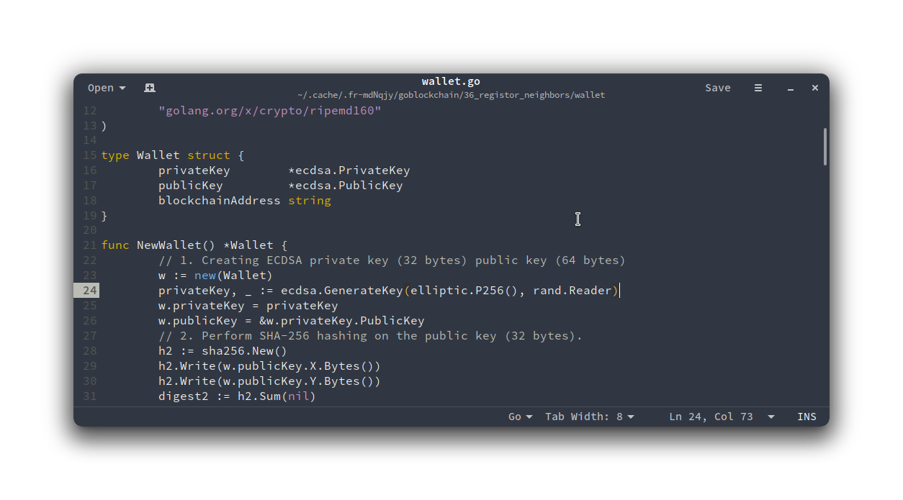
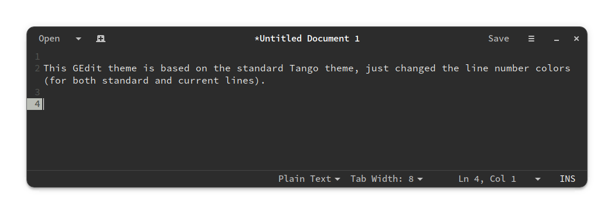

## GEdit

Install these color schemes by:
- copying them to `~/.local/share/gedit/styles`
- restart GEdit
- select the theme from _Preferences_ > _Fonts & Colors_ tab.

 

### Tango Graphite variation

My currently used theme, matching my nowadays preferred [Graphite GTK](https://github.com/dxps/Graphite-gtk-theme) theme.

 

### Tango variation

 

### Rainbow Neon small variation

 
