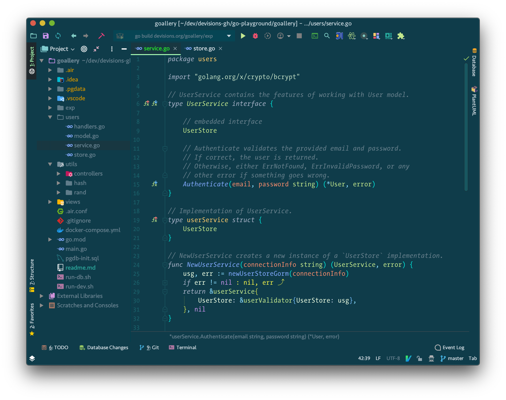
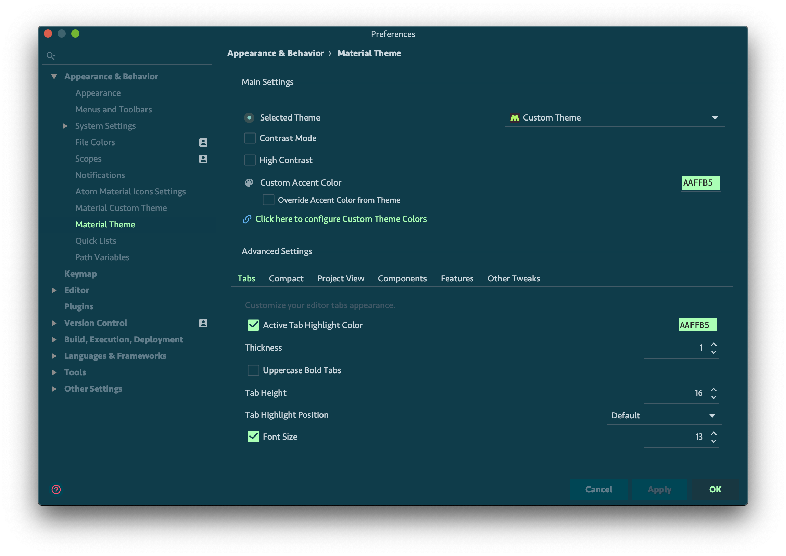

### About

2020-04 | This is my current flavor of Material Theme - Custom version.

As always, the files extensions means:

-   `xml` is the export of Material Design Custom Theme settings
-   `icls` is the exported color scheme

### Screenshots

Here is how it looks like:

Some settings on the more general Material Theme menu:

