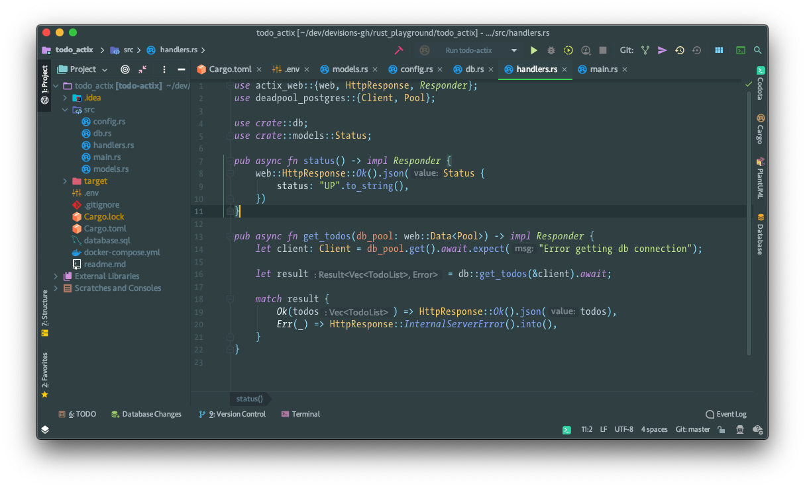

### Material Custom theme - a Vipassana flavor

A tryout based on Material Custom Theme (a capability of Material Design plugin).

Exported (and usable for import) assets:
- the theme, exported as an XML file (`org.devisions.design.intellij.materialcustomtheme.vipassana.xml`)
- the editor color scheme, exported as ICLS (`devisions - Material Custom Theme (Vipassana).icls`)

Result:

