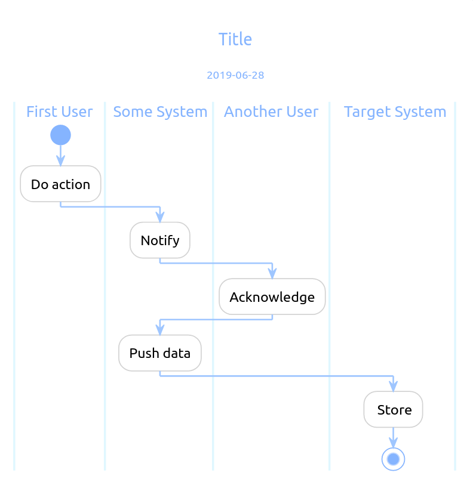
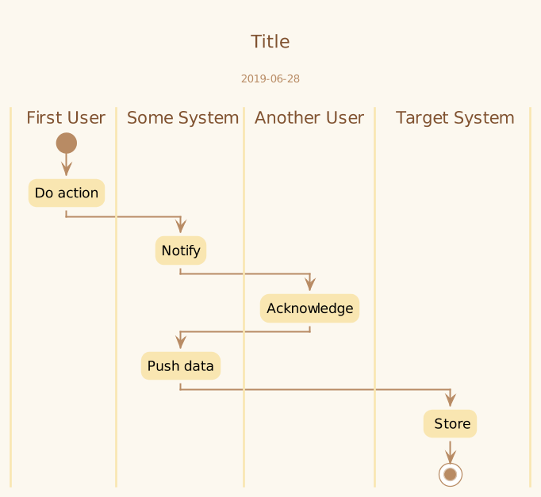

## PlantUML Styles

A collection of my workings on PlatUML styles.

 

### Light Blue Classic

A classic and minimal style.

 

### Solarized Light

Once I got attracted by the Solarized Light theme, therefore I created and used an `edge_template.puml`. See an example of a result below.

