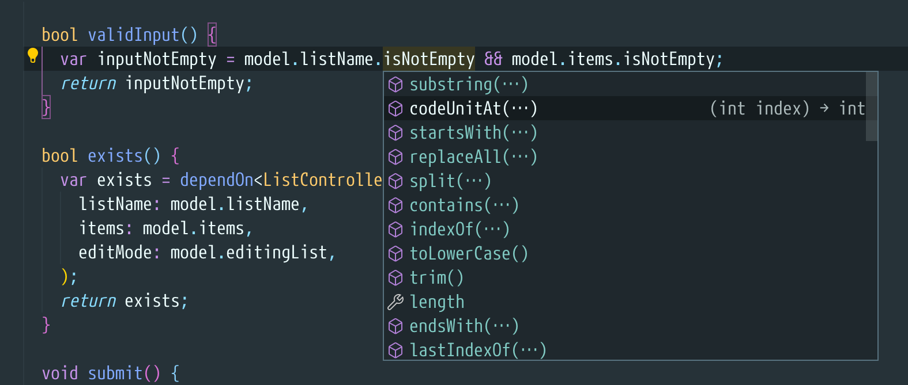
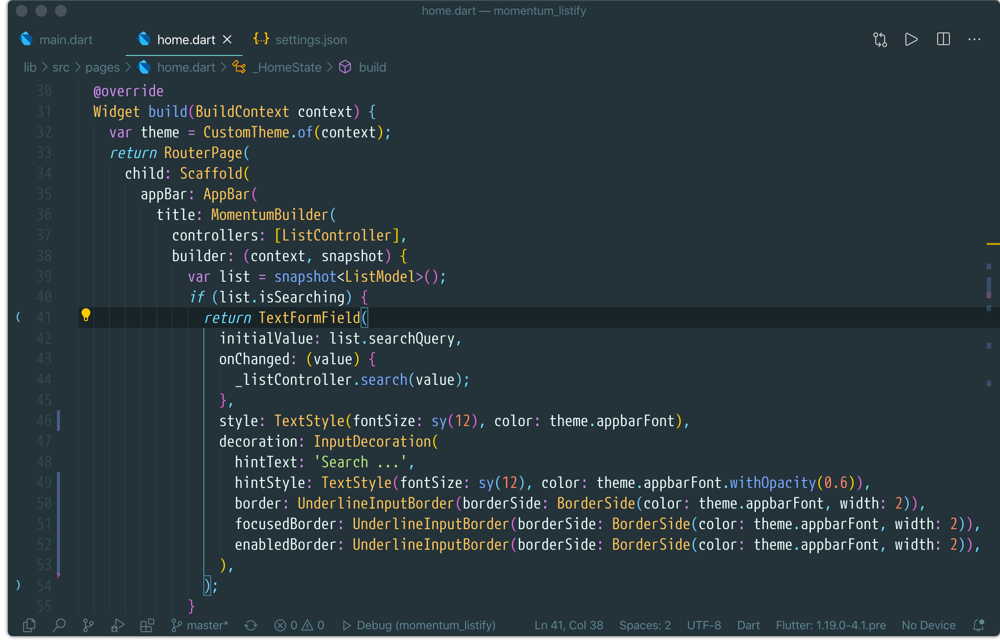
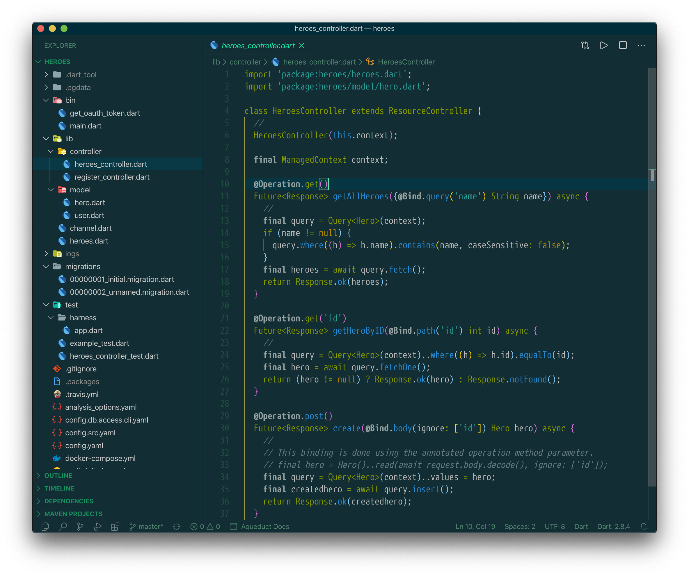

## 2020-11-23

1. Added `ALT+6` keybinding to show go Test Explorer.<br/>(see `keybindings__linux.json`)
1. Added the associated button (for go Test Explorer) to Activitus Bar.<br/>(see `settings___dxps___2020-11-23.json`)

<br/>

## 2020-11-13

Disabled triggering any menu appearance while using ALT key, as it plays an important role in my XFCE desktop.

<br/>

## 2020-11-02

More color customizations to my CMT flavor: panels (active and inactive foreground color to "Problems | Output | Debug Console | Terminal" views) and active tab foreground color.

<br/>

## 2020-11-01

Customized the background of _Community Material Theme_ (CMT) to use a solarized dark color (`#002b36`).

<br/>

## 2020-08-14

Settings changes synced in `settings.json`.

<br/>

## 2020-06-25


Added `editorSuggetWidget` colors for an better contrast.<br/>
Settings saved in [settings___2020-06-25.json](./settings___2020-06-25.json) file.




<br/>

## 2020-06-22

Using _Community Material Theme_ and some some other customizations such as theme specific color customizations, the lovely "M+ 1mn" font, and dart.lineLength extended to 117. These are backed up in `settings___2020-06-22.json` file.




<br/>

## 2020-06-08

Now I am using a customized Solarized Dark based theme.<br/>
[`settings__mb.json`](./settings__mb.json) contains the full settings file used on `mb` laptop.

And this is a sample of the theme:



<br/>

## 2020-05

On my Xubuntu 20.04 I am using [`settings__xubuntu_snap.json`](./settings__xubuntu_snap.json) file as VSCode settings.


<br/>

## Theme specifics

- [Qiita theme > Status Bar colors](qiita_theme.md)

<br/>

## Status Bar > BG & FG when Debugging

Settings to customize the foreground and background of the status bar when you are in debug mode and the theme comes with unpleasant colors for the status bar:

```json
{
    "workbench.colorCustomizations": {
        "statusBar.debuggingBackground": "#203447",
        "statusBar.debuggingForeground": "#4B987E",
    },
}
```


<br/>

## Dart > Closing Labels

You can turn off showing the closing labels using:
```json
{
    "dart.closingLabels": false,
}
```


<br/>

## Debug Console > A very condensed font

This is what I currently use:
```json
{
    "debug.console.fontFamily": "PhoenicaMono200, '64-SRC-Medium'",
}
```


<br/>

## Old Note

The current version 1.9.0 does not provide (yet) support (options) for customizing the status bar.

Meanwhile, the following commands can be used from Developer Tools (`Help > Toggle Developer Tools`):
```javascript
document.getElementById("workbench.parts.statusbar").style.background = "#333"
document.getElementById("workbench.parts.statusbar").style.color = "gray"
```
And this is the result:


