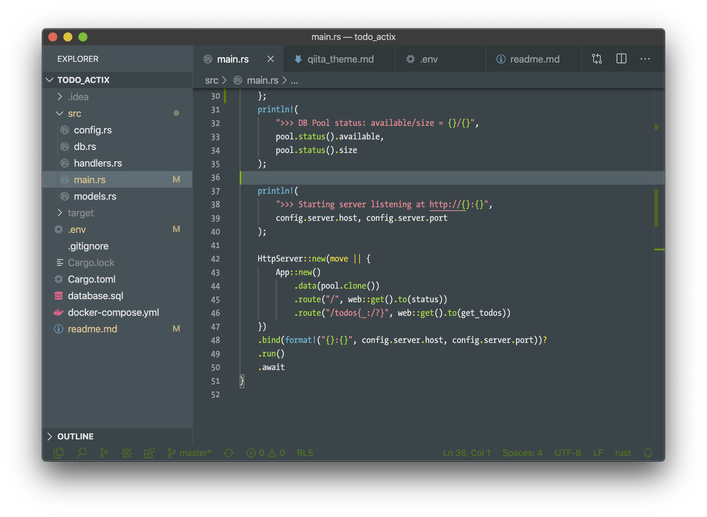

## Qiita Theme > My Settings

Although the Qiita's status bar background looks very fresh, I switched the background and foreground to minimize the visual impact. See below the settings (including the debugging related colors):

```json
    "editor.fontFamily": "TheSansMonoCd-W5Regular, Menlo, Monaco, 'Courier New', monospace",
    "editor.minimap.enabled": false,
    "editor.scrollBeyondLastColumn": 2,
    "editor.scrollBeyondLastLine": false,
    "editor.smoothScrolling": true,
    "workbench.colorCustomizations": {
        "breadcrumb.foreground": "#508670",
        "breadcrumb.focusForeground": "#5ec59c",
        "breadcrumb.activeSelectionForeground": "#508670",
        "breadcrumbPicker.background": "#374549",
        "statusBar.background": "#374549",
        "statusBar.foreground": "#508670",
        "statusBar.debuggingBackground": "#374549",
        "statusBar.debuggingForeground": "#C6A82A",
        "statusBar.noFolderBackground": "#374549",
    },
    "vetur.validation.template": false,
```

And the result is:



