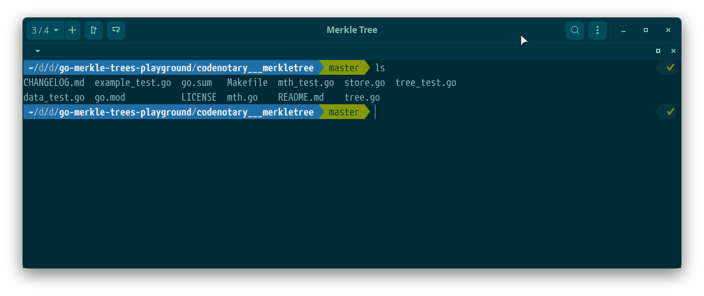

## XFCE 4 related assets

 

### ZorinGreen-Dark

This is the theme that I'm using on my new Dell desktop. It is based on a ZorinOS theme flavor. I very much like it! :)

 

### ChromeOS-Dark-Oceanic-Remix

This is the theme that I used on Dell laptop. It's a small "remix" of the existing and wonderful [ChromeOS-Dark-Oceanic](https://www.pling.com/s/XFCE/p/1345605/) theme,
just included more green color into the foreground.

